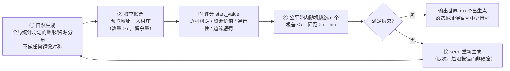
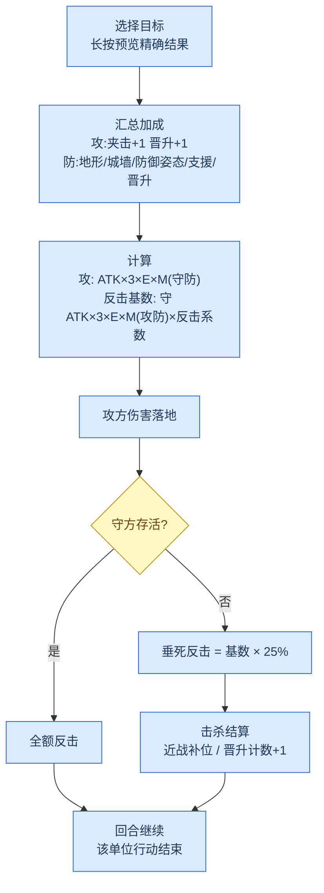
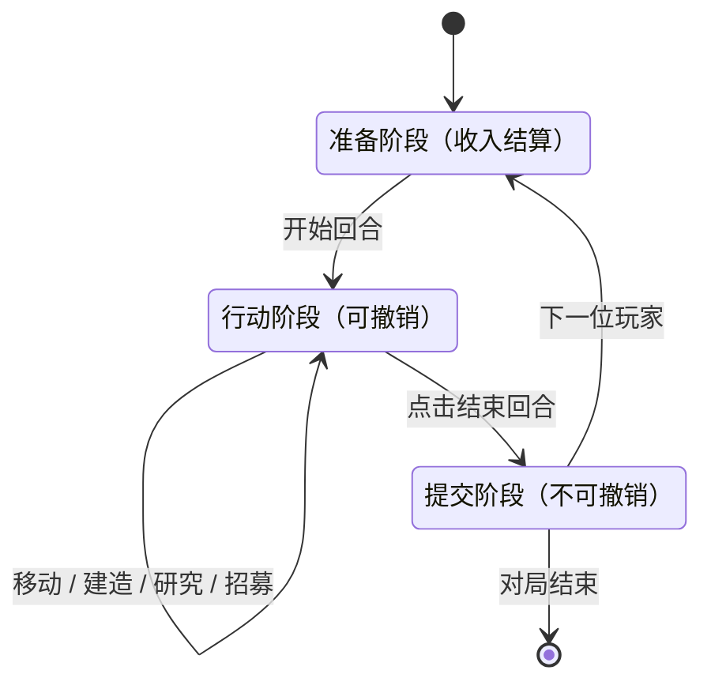
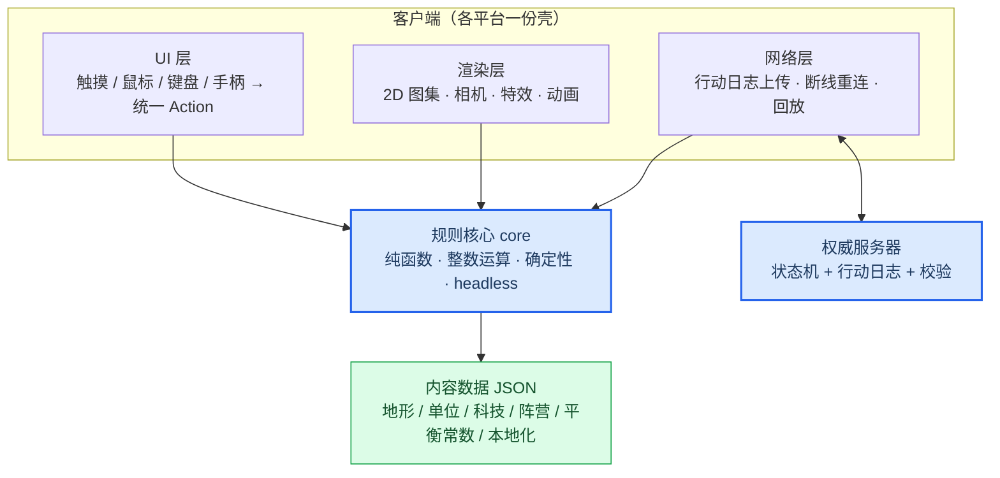

# Squarefolk（方族）设计文档

版本 **v0.9** · 状态：草案 · 当前阶段 = **M0 核心（规格先行，未动代码）**，待拍板项见 [§9](#-9-待拍板清单)
项目根目录：`~/disk/songl/squarefolk/`

**修订记录**

| 版本 | 变更 |
| --- | --- |
| v0.1 | 初稿：基线调研、战斗/机制调整提案、多平台架构、授权方案 |
| v0.2 | ① 邻接**定为 8 向** ② 远程被贴**允许反击**，改用"反击系数"数值调 ③ 晋升**取消 +HP**，改为 +攻+防 ④ **攻防体系整体重做（§3.3–§3.4）**：防御改为纯减伤点数制、反击改用自身攻击力、位置因素统一折算为攻/防点数 ⑤ 交战改为同时结算并据此复核 §3.7 数值 |
| v0.3 | ① 确立**姿态与先手原则**：非防御姿态下先手优势明确成立，防御姿态（驻守）是唯一反制（§3.3）② 反击分档：存活全额 / **被击杀仅 25% 垂死反击**（§3.6）③ 随机收敛：**默认零随机**，可选方差硬上限 **±1 伤害**（§3.5-B1）④ 防御姿态判定改为"上一回合未行动"（§3.4）⑤ §9 重构：D4 技术栈 / D5 美术 / D7 命名**暂缓**，只推核心 |
| v0.4 | ① 架构固化为**三件套分离**：规则（代码）/ 数值（配置）/ 界面（外壳），依赖单向、core 零硬编码（§5.1）② 新增**配置工具**：validate / diff / 平衡模拟 sim / dump（§6.1）③ 新增**制作与发布**：Godot 导出 + TapTap 资质矩阵（官方文档已查证）（§5.9）④ D4 改为倾向 **Godot 4 + TapTap 首发** |
| v0.5 | ① **经济与建设重写**（§4.2）：三层收入结构 + TTR 主指标（2–4 回合健康区间）+ 反滚雪球清单 + **出生公平性前置**（基线最大社区痛点）② 新增 **§6.2 自动对局方法论**：配对种子、两层验证、四层 bot、指标面板与报警阈值、CI 分级 ③ §2.6 地图生成加入公平性硬约束与换座验收 |
| v0.6 | ① 新增**核心可移植设计**（§5.1）：规格先行 + 黄金测试向量、7 个 API 入口、三种集成方式（直调 / FFI-WASM / 独立进程）、移植性硬规则、规范化序列化与状态哈希 ② 新增**数据可移植设计**（§6）：数据五层与三红线、字符串 id 策略、源格式≠运行格式、schemaVersion/rulesVersion 双轨、per-shell 资产清单 |
| v0.7 | **出生点方案改版**：放弃对称/镜像生成（对手可从自己半区反推你的地形，信息相关性≈1）→ 改为 **均匀自然生成 → 候选城址评分 `start_value` → 公平带内随机挑 n 个 → 无解换 seed 重生成**（§2.6 流程图 + §4.2.4 取舍表） |
| v0.8 | ① 编辑器**固定为桌面应用**，CLI 保留为 CI 入口（§6.1）② 新增 **§6.3 桌面编辑器选型**：Tauri（稳定线 v2.12.0，**v3 仅 3.0.0-alpha.0**）vs Wails（v3 = beta.27）现状对比、选型判据、**双宿主互为参照的三层对账** ③ §9 新增 **D13 · core 实现语言**，与游戏壳语言解耦 |
| v0.9 | **定名 Squarefolk（方族）**：Tessera / Quadratum / Gridholm 等撞名候选排除后选定，`Squarefolk` 检索无同名游戏或产品；创建仓库 `~/disk/songl/squarefolk/` 并 `git init`；D7 更新 |

---

## 📌 概览

一句话定位：**方形四边网格上的轻量回合制 4X，触摸优先、全平台同源、非商业开源。**

### 0.1 与原作（The Battle of Polytopia）的关系

| 类别 | 内容 |
| --- | --- |
| ✅ 借鉴 | 方形格网与切比雪夫移动、8 邻接战术层、"星星"单货币经济、三层科技树反扩张定价、异步联机思路 |
| 🔧 改造 | **攻防体系整体重做（v2）**、姿态与先手、围城机制、和平条约、回合内的撤销与预览 |
| 🚫 绝不碰 | 原作的美术、音乐、字体、UI 资源；部落名 / 单位名 / 品牌名（如 "Polytopia"、"Xin-xi"、"Cymanti" 等）；原作代码与数据文件 |

机制规则与数学公式本身不受版权保护（属"思想"范畴），可以参考与重实现；**表达层（美术、音频、文字、命名）受保护，全部原创**。原作曾因商标问题从 "Super Tribes" 改名，命名需提前做商标检索。[^1]

### 0.2 三条硬原则（贯穿全文）

1. **确定性核心**：规则核心纯函数、整数运算、不依赖渲染与平台 API —— 回放、联机 lockstep、AI 训练、自动化测试全部由此派生；**战斗结果零随机**，预估空间宽度为 0。
2. **触摸优先**：每个操作先设计手指路径，再映射到鼠标/键盘/手柄；不存在"必须 hover 才能发现"的信息。
3. **非商业开源**：CC BY-NC-SA 4.0（或等效软件许可，见 [§7](#-7-授权与合规)），作者保留日后另行商业授权的权利。

---

## 🎯 1. 目标与非目标

### 1.1 目标

| 维度 | 指标 |
| --- | --- |
| 一局时长 | 快节奏 20–35 分钟（11×11 地图），长局 ≤ 60 分钟 |
| 上手成本 | 首局引导 ≤ 3 分钟，核心规则一页纸讲完 |
| 平台 | iOS / Android / Web / Windows / macOS / Linux 同源一套代码，跨平台可对战 |
| 联机 | 异步对局为一等公民（24h 回合），断线重连 = 拉行动日志重放 |
| 确定性 | 同种子 + 同行动日志 → 任意平台逐位一致的对局哈希；**战斗零随机，长按给出精确伤害** |
| 可读性 | 战斗结果可心算：**一个攻、一个防、一个减伤百分比**，加成逐项可见 |
| 开源 | CC 非商业许可，内容全部 JSON 数据化，可被第三方 fork 与 mod |

### 1.2 非目标（v1 明确不做）

- 不做实时制、不做 RTS 化的"同时多单位操作"
- 不做复杂外交树（条约机制只保留一个简化版，见 §4.5）
- 不做 UGC 平台 / 账号体系 / 排行榜服务（留接口，不自建）
- 不做 3D 写实美术；不追原作的"低多边形方块"视觉风格（避免混淆）
- 不做 42 种单位的全量内容（v1 收敛到 10 种陆地单位 + 2 种水域交互）

---

## 🗺️ 2. 世界模型：四边网格

### 2.1 为什么保持方形（4 边）

| 维度 | 方形 4 边格 | 六边格 |
| --- | --- | --- |
| 渲染 | 矩形图集 / TileMap 直接可用，移动端批处理友好 | 需要轴偏移或菱形切片，图集与命中测试更绕 |
| 触摸命中 | 命中测试 = 矩形区间，双指缩放下最稳 | 尖角区域手指易误判 |
| 数据结构 | 二维数组 `[y][x]`，存档/序列化直观 | 轴坐标转换、序列化多一层 |
| 视觉辨识 | 行列整齐，一眼读出"谁在哪"，适合小屏 | 斜向排列在小屏上更难扫读 |
| 玩法差异 | **与市面六边形 4X 形成辨识度**（Civ 系多为六边） | 同质化 |

结论：**保持方形 4 边格**，并把它当作产品的视觉与算法签名，而不是妥协。

### 2.2 坐标、邻接与距离

- **坐标**：`Tile{ x: u16, y: u16 }`，原点左上，行主序存储；屏幕坐标到格坐标的换算在渲染层完成。
- **距离**：切比雪夫距离 `d = max(|dx|, |dy|)` —— 方形格上"王车步"与射程语义天然一致，射程 2 = 5×5 覆盖区。[^2]
- **邻接**：**8 向（含对角），已定案** —— 攻击、移动、夹击、支援判定全部基于 8 邻接；攻击可打斜角。[^3] 8 邻接也是"夹击"规则成立的前提（4 向只有 2 组对边，8 向有 4 组 180° 对角组合）。
- **移动消耗**：每格 1，道路 0.5（消费时向上取整，即剩 0.5 也能走进 1 费的格）；森林/山地无道路时"可进入但不可穿过"。
- **控制区（ZOC）**：移动进入敌方相邻格后本回合强制停止，优先级高于道路加速 —— 这是小地图上制造战术纵深的核心规则，保留。[^4]

### 2.3 地图尺寸（基线）

| 尺寸 | 规格 | 格数 | v1 用途 |
| --- | --- | --- | --- |
| Tiny | 11×11 | 121 | 快速局 / 手机竖屏单手局 |
| Small | 14×14 | 196 | 标准 1v1 |
| Normal | 16×16 | 256 | 标准多人 / 限时积分局 |
| Large | 18×18 | 324 | 4–6 人 |
| Huge | 20×20 | 400 | 桌面专属 |
| Massive | 30×30 | 900 | 桌面专属，性能压测基准 |

尺寸与人数、模式挂钩的规则照抄基线经验即可（基线：1 对手 → Tiny，2 → Small，3 → Normal，4+ → Large）。[^5]

### 2.4 地形与移动消耗（v1 草案）

| 地形 | 移动 | 通行 | 防御 | 产出 | 备注 |
| --- | --- | --- | --- | --- | --- |
| 平原 Plain | 1 | ✅ | +0 | 农作物 | 默认 |
| 森林 Forest | 1（进入后停） | ⛔ 穿越 | **+1** | 木材 | 研究对应科技后生效 |
| 山地 Mountain | 1（进入后停） | ⛔ 穿越 | **+1** | 金属 | 视野 +1 |
| 沙漠 Desert | 1 | ✅ | +0 | — | |
| 沼泽 Swamp | 1.5 | ✅ | +0 | — | |
| 浅水 Shallow | 1 | 仅两栖 | +0 | 渔场 | 待调 |
| 深水 Ocean | 1 | 仅舰船 | **+1** | — | 待调 |
| 冰原 Ice | 1 | ✅ | +0 | — | v2 |
| 城市 City | 1 | ✅ | **+1**（城墙 **+2**） | 星星 | 见 §4.4 |
| 村庄 Village | 1 | ✅ | +0 | 占领奖励 | 中立 |

> **防御列是"加在 DEF 上的点数"，不是乘区** —— 所有防御类因素在 §3.4 统一折算，这是 v2 攻防体系的核心简化（基线的 1.0 / 1.5 / 4.0 三档乘区被合并掉）。

### 2.5 视野与迷雾

- 单位视野半径 1，山地 / 城市 / 哨塔 2；未探索区为"云层"，已探索无视野为"暗区"（保留轮廓）。
- 迷雾必须是**纯函数**：`visible(player, tile, state) -> bool`，不引入逐帧随机。
- 多人对局中迷雾状态按玩家分片序列化，存档体积极小（位图 RLE）。

### 2.6 地图生成与出生点选择（v0.7：不对称，事后挑选）

- **种子驱动**：`seed` + 版本号即可完整重建整张图（回放与分享的基础）。**种子只决定世界，不参与任何战斗结算**；生成与挑选全部发生在建局期。
- 参数：尺寸、水域比例（6 档）、大陆/岛屿模式、资源密度。

**生成流程：两段式 —— 先自然生成，后挑选出生点**



**为什么不对称生成**：镜像/对称图会让对手**从自己的半区反推你的地形**（信息相关性 ≈ 1），探索、欺骗与情报战全部失效 —— 公平不该以牺牲不可预测性为代价。

**为什么只靠"均匀生成"不够**：统计均匀仍可能局部极端（这边 3 村 5 资源、那边 1 村 1 资源，正是基线社区最大抱怨）。所以**均匀只是前置，公平由挑选保证**。

**`start_value` 评分（候选城址，权重进 `balance.json`）**

| 因子 | 说明 |
| --- | --- |
| 近村可达性 | 到最近 k 个村庄的切比雪夫距离之和（村庄 = 一次性扩张机会） |
| 资源价值 | 半径 R 内可采集资源总值（按采集成本折算成 ★） |
| 通行性 | 半径 R 内可通行格比例（防孤岛 / 背山死地） |
| 边缘惩罚 | 角落 / 贴边扣分（信息与纵深劣势） |
| 遗迹期望 | 半径 R 内遗迹数量（若该模式启用遗迹） |

**挑选规则**

1. `start_value` **极差 ≤ ε**（ε 与 ±1★ 同量级，具体值进配置）
2. 出生点两两间距 ≥ `d_min`（防挤在同一区域）
3. **公平带内随机**：满足约束的组合通常不止一组 → 在合法组合里**等概率随机选一组**，而不是总挑"最优 n 个" → **公平（由约束保证）与不可预测（由随机化保证）解耦**
4. 带内无解 → 换 seed 重新生成（限次重试，超限报错而非硬塞一个不公平的局）
5. 求解：n ≤ 4 穷举；n 大时按分数排序取最接近的簇 + 局部交换优化

**验收**（进 §6.2 指标面板）：换座胜率差 ≤ ±5%；公平带生成成功率（含重试次数分布）；可选的**信息泄露指标** —— 用"我方已知半区"预测敌方地形的准确率，应与随机基线无显著差异（对称图会接近 100%）。

- 参考实现：QuasiStellar 的生成算法（**GPLv3，只能读思路不能抄代码**，见 §7.2）。[^6]

---

## ⚔️ 3. 战斗系统（本作的核心调整区）

### 3.1 基线公式（原作，作为对照与标定参照）

```
attackForce  = attacker.attack  * (attacker.hp / attacker.maxHp)
defenseForce = defender.defense * (defender.hp / defender.maxHp) * defenseBonus
total        = attackForce + defenseForce
attackResult  = round(attackForce  / total * attacker.attack  * 4.5)
defenseResult = round(defenseForce / total * defender.defense * 4.5)
```

`defenseBonus`：无加成 1，森林/山地/海洋/城市 1.5，城墙 4。四舍五入到整数。[^7]

**特征**：完全确定性（无随机）、血量按比例线性衰减、4.5 系数决定伤害上限、先手方拿到"最后一击"。攻击方的防御值与防守方的攻击值不参与计算 —— 这正是 v2 要改的结构性问题（见 3.2）。

### 3.2 基线的问题

| # | 问题 | 后果 | 依据 |
| --- | --- | --- | --- |
| P1 | **先手价值与姿态无关**：先手必胜，但"谁站定了、谁刚推进完"不参与结算 | 防守方只能靠不出手维持僵局；"谁撕毁和平条约谁赢" | 社区对和平条约机制的连续抱怨帖（2023）[^8] |
| P2 | **骑士可一击秒杀同级骑士** | 骑兵对决退化为"谁先出手"，连锁清场 | 社区平衡讨论，建议 HP 10→12 以避免互秒[^9] |
| P3 | **血量线性惩罚过狠**：10% 血 = 10% 攻防 | 残血单位近乎白板，中盘滚雪球难逆转 | 战斗计算器 FAQ 的公式说明[^7] |
| P4 | **防御值职责混淆**：DEF 同时决定"减伤多少"与"反击多疼"，0 防单位 = 恒吃满伤**且反击为 0** | 角色不可读；玻璃炮不是高风险高回报，是纯白板 | 3.1 公式结构直接推导 |
| P5 | **城墙 4× 与"5 星更划算"互相矛盾** | 防御建筑既强又不值得造 | 官方 wiki 策略页[^10] |
| P6 | **晋升 +5 HP 在此模型里双重收益** | +血同时提升坦度与输出，玩家感知不到"成长在攻还是防" | 3.1 公式的血量项直接推导 |

### 3.3 攻防体系 v2（整体重做）

**设计目标**：职责单一、可心算、可逐项预览、支持攻防成长、位置因素统一入参。

#### 🎯 核心设计原则：姿态与先手

> **先手优势属于攻击方 —— 但只在守方处于"非防御姿态"时成立；防御姿态是防守方唯一的反制手段。**

| 守方姿态 | 判定 | 结果（见 §3.7） |
| --- | --- | --- |
| **非防御姿态** | 上一回合**移动过或攻击过**（正在行军、刚推进、刚扩张） | **先手优势明确成立**：攻方 3 刀获胜 —— 抓住敌人行军间隙出手，正当且有回报 |
| **防御姿态（驻守）** | 上一回合**既未移动也未攻击**（待机 / 治疗 / 本回合新建单位） | **守方占优**：1v1 直接上会先攻方阵亡 → 必须用夹击、远程或兵力差破解 |

这条原则替代了"处处削弱先手"的思路：**不消灭先手优势，而是让它由姿态决定。** 玩家的战术循环因此变成 —— 「趁敌行军 → 先手吃掉」「敌已站稳 → 我也站稳 / 集结夹击」，双方都有明确最优动作，而不是互相等对方先动手。姿态同时是 AI 可直接读取的显式信号（见 §4.7）。

#### 属性职责

| 属性 | 职责 | 说明 |
| --- | --- | --- |
| **HP** | 纯缓冲 | 只决定"还能挨几下"与血量效率，**不再直接参与攻防数值换算**；晋升不加 HP |
| **ATK 攻击力** | 输出 | 决定主动攻击伤害 **与反击伤害**（v2 关键变化：反击用你自己的攻击力） |
| **DEF 防御力** | 纯减伤 | 只决定被击中时的减伤百分比，**不再决定反击强度**（v2 关键变化） |
| **反击系数** | 单位参数 | 反击伤害 = 该单位自身输出 × 系数。近战 1.0 / 远程 0.5 / 攻城 0.25 / 医疗 0 |
| **MOV / RNG** | 机动 / 射程 | 不变 |

> 对比基线：基线里"防御"一个数字干两件事（减伤 + 决定反击力度），导致坦克 = 反伤怪、0 防 = 白板；v2 里**攻 = 你打多疼（含反击），防 = 你少挨多少**，一眼可读，成长也有了两个独立旋钮。

#### 伤害公式（整数实现）

```
血量效率    E(x) = 50% + 50% × (x.hp / x.maxHp)     # 50%~100%，软化血量惩罚（修 P3）
减伤率      M(d) = 100% − 12% × d                    # d = 防方 DEF_eff ∈ [0,5]，上限 60%
主动伤害    D    = ATK_eff(攻) × 3 × E(攻) × M(DEF_eff(守))
反击基数    C    = ATK_eff(守) × 3 × E(守) × M(DEF_eff(攻)) × 反击系数(守)
实际反击         = C                  （守方存活）
实际反击         = C × 25%            （守方被本次击杀 → 垂死反击，见 C7）
位置加成         全部折算进 ATK_eff / DEF_eff（见 §3.4）
随机             默认无（B1 若开启，硬上限 ±1 伤害）
```

**整数守则**：ATK/DEF 以 ×10 定点存储（支持 0.5 步进），中间运算全部整数，最终一次性四舍五入（half-up），各平台行为一致。标定常数 `K = 3`、`每点减伤 12%`、`DEF_eff 上限 5`、`E 曲线`、`垂死反击 25%` 均进 `balance.json`（见 D10）。

#### 该体系如何回应 3.2 的问题

| 问题 | v2 的解法 |
| --- | --- |
| P1 先手与姿态无关 | **姿态化**：非防御姿态 → 先手优势明确（示例 1）；防御姿态 → 守方占优（示例 2）；破解驻守靠夹击（示例 3）。先手价值由"敌人上一手在干什么"决定，不再是无条件铁律 |
| P2 骑士互秒 | 减伤曲线**结构性保证**：ATK ≤ 3.5 的单位无法秒杀 DEF ≥ 2 的满血单位（10.5 × 0.76 = 7.98 < 10，示例 5）；低防目标被秒是刻意保留的 |
| P3 血量雪球 | `E` 从线性改为 50%+50%：残血单位保留一半战斗力，交换节奏拉长，支援/夹击有介入空间 |
| P4 防御双职责 | DEF 纯减伤；反击来自 ATK × 反击系数 → 玻璃炮照样能反击，只是系数低 |
| P5 城墙矛盾 | 城墙 = **+2 防 + 耐久 3**，可被围攻摧毁 → 强度与破解路径都可见可算 |
| P6 晋升加血 | 晋升改为 **+1 攻 +1 防**（见 §3.9） |

#### 与其他系统的接口

- **可读性硬要求**：所有加成必须能在"长按预览"里逐项列出（`攻 2 (+1 夹击)`、`防 3 (+1 森林 +1 防御姿态)`）。
- **数据化**：`K`、`12%`、`DEF 上限`、`E 曲线`、`反击系数`、`垂死反击` 全部进 `balance.json` → 平衡补丁 = 改数据，回放带数据版本号。

### 3.4 位置因素折算表（一切加成只有两种：+攻 或 +防）

| 来源 | 类型 | 数值 | 规则 |
| --- | --- | --- | --- |
| 地形：森林 / 山地 | 防 | +1 | 研究对应科技后生效（保留基线设定） |
| 地形：深水 | 防 | +1 | 待调 |
| 城市（未被围、有驻军） | 防 | +1 | 被围期间失效 |
| **城墙**（耐久未耗尽） | 防 | **+2** | 耐久 3，围城每回合 −1（见 §4.4） |
| **防御姿态 / 驻守** | 防 | **+1** | 判定：**上一回合既未移动也未攻击**（待机、治疗、本回合新建单位均属防御姿态）；本回合一行动即失去 |
| **支援**（每相邻友军） | 防 | +0.5，上限 +1.5 | 落单单位天然脆弱，鼓励阵型 |
| **夹击**（另一敌方单位位于 180° 相对两侧） | **攻** | **+1** | 仅攻击时判定；8 邻接下有 4 组对角线组合 |
| **晋升** | 攻 / 防 | +1 / +1 | 每单位一次，见 §3.9 |
| **DEF_eff 上限** | — | 5（= 60% 减伤） | 防止无敌堆叠；"地形1 + 城1 + 墙2 + 驻守1"刚好触顶 |

**所有加成都是点数、都走同一个公式** —— 没有独立乘区、没有例外分支。基线里"1.5× 地形 / 4× 城墙 / 中毒三档系数"的乘区迷宫被彻底合并。

> **姿态为什么按"上一回合"判定**：回合制里对手行动时我方不能动，若按"本回合未移动"判定，几乎所有单位都会自动驻守，姿态失去意义。按"上一回合是否行动"判定，姿态才成为**上一手选择留下的、可被对手读取的战术信号**。

### 3.5 调整方案（按优先级分级）

#### ✅ C 级（进 v1）

- **C1 · 同级不可互秒**：由减伤曲线**结构性保证**（ATK ≤ 3.5 vs DEF ≥ 2 → 7.98 < 10），无需硬 clamp；保留可选内容安全上限（`dmg ≤ maxHp × 0.85`，默认关）应对未来超模数值。
- **C2 · 防御姿态 +1 防**：姿态与先手原则的落地。非防御姿态的敌人照常吃先手优势，防御姿态则反制先手。UI 显示盾牌标记。
- **C3 · 支援 +0.5 防 / 夹击 +1 攻**：把 8 邻接变成阵型深度；**夹击是破解防御姿态的标准答案**（示例 3：夹击 2 刀破驻守）。
- **C4 · 城墙 = +2 防 + 耐久 3**：围城每回合 −1 耐久，清零前城墙无效且城市不产出 → 攻城从"硬啃 4 倍减伤"变成"围 2–3 回合"的可计算时间投资。
- **C5 · 远程允许反击，靠数值调**：远程单位**可以**在被贴身时反击 —— 它已经吃了更多近战伤害，反击再通过**反击系数**压低（弓手 0.5、投石 0.25）。不引入特殊规则分支，公式保持单一；调参入口 = 弓手 ATK 与反击系数。
- **C6 · 战斗预览为硬性 UX 需求**：长按目标格 → **精确**伤害、精确反击、存活判断、姿态与攻防加成逐项拆解。全平台实现，触摸端长按 ≥ 250ms。**零随机 → 预估空间宽度为 0，这是"紧预估"的极限形式。**
- **C7 · 垂死反击 = 基数 × 25%**：守方被本次攻击击杀时，反击只按基数的 25% 结算（实算 ≈ 1 点）。
  - **击杀基本白赚** → 非防御姿态下的先手优势因此干净利落（示例 1、6、7）；
  - 但**不是 0**：0 防单位临死仍换 1 点，玻璃炮不是纯粹白送（修 P4）；
  - 攻击发起者被反击致死时**没有**对应规则 —— 伤害已先行落地，全规则只有这一个分支。

#### 🔶 B 级（原型期实测后拍板）

- **B1 · 随机：默认关闭；若开启，硬上限 ±1 伤害**。不用百分比方差（±10% 在 5 点伤害上是 ±0.5，玩家无法感知边界）；直接以**伤害点**为单位限制：`最终伤害 ∈ [D−1, D+1]`，且 UI 必须显示区间（如 `4–5`）。**预估空间宽度 ≤1 点，任何情况下不得放宽。** 更优先的变化来源是**可见状态**（姿态、地形、支援、夹击）—— 同样制造不确定性，却不牺牲可预估性。
- **B2 · 跨回合结算式反击**：防守方在己方回合才结算反击。能进一步压缩先手价值，但与"确立非防御姿态先手优势"方向相反 —— **默认不做，仅在竞技模式需要时评估**。
- **B3 · 和平条约重做**：毁约方本回合不可攻击（军队被动撤出），但下回合全体获得"突袭"一次性加成 —— 背叛有收益也有代价，防守方知道"我有 1 回合窗口备战"。

#### ⚪ D 级（留接口不做）

- 单位经验树（晋升已定为一次性 +1/+1）、伏击 / 反伏击、地形高度差

### 3.6 结算流程



**全程无浮点、零随机**；四舍五入在核心层统一实现，避免各平台 `round()` 行为差异。守方反击基于**交战前的血量**（不受本次受伤影响，与基线一致）。

### 3.7 数值校验（K=3、每点 12%、E=50%+50%、垂死反击 25% 下的实算）

| # | 场景 | 关键参数 | 主动伤害 | 反击 | 结论 |
| --- | --- | --- | --- | --- | --- |
| 1 | 步兵 vs 步兵（守方**非防御姿态**，平原） | 防 2 → 24% | **5** | **5** | **先手优势明确**：3 刀攻方获胜、剩 3 血（含守方垂死反击 1）；基线为 2 刀剩 5 血 |
| 2 | 步兵 vs **防御姿态**步兵 | 防 2+1=3 → 36% | **4** | **5** | 逐刀推演：**先攻方阵亡、守方剩 1 血** → 防御姿态是先手优势的唯一反制 |
| 3 | 步兵**夹击**防御姿态步兵 | 攻 2+1=3、防 3 → 36% | **6** | **5** | **2 刀破驻守**，攻方剩 4 血，守方垂死反击 1 → 破解防御姿态的标准答案 |
| 4 | 步兵 vs 弓手（被贴身，非防御姿态） | 弓手防 1 → 12%；弓手 ATK 2.5、反击系数 0.5 | **5** | **3** | 远程被贴多吃伤、反击弱（挨 5 只还 3）—— **数值表达，无特殊规则**（C5） |
| 5 | 骑士 vs 骑士（均非防御） | 攻 3.5 → 10.5 × 0.76 = 7.98 | **9** | **9** | **不再互秒**（基线为 14 一击毙命，修 P2） |
| 6 | 骑士 vs 投石 | 投石防 0 → 0% 减伤 | **11**（秒杀） | **1**（基数 3 × 25%） | 0 防 = 满伤被秒，垂死只换 1 → **击杀几乎白赚**（C7） |
| 7 | 巨人 vs 步兵 | 攻 5 → 11.4；巨人防 4 → 48% | **11**（秒杀） | **1**（基数 3 × 25%） | 高攻秒基础步兵与基线一致；处决成本 ≈ 1 点 |
| 8 | 剑士 vs 守卫（城内**防御姿态**） | 防 3+城1+姿态1 = 5 → 60% | **4** | **3** | 满配城防把 6 降到 4，配合 15 血 = 4 刀才破 —— 但**围城破墙后加成全失**（C4） |

> 各行为**单变量对照**（只叠加该行讨论的加成），数值为四舍五入后的整数。
> **三条设计验收线：① 非防御姿态 → 先手必胜（行 1）② 防御姿态 → 先手必败（行 2）③ 夹击可破防御姿态（行 3）。**
> 以上为**标定起点**：M0 用自动对局（1000 局随机策略）回归 —— 均势交换 2–3 刀内分胜负、无无限僵局、无单单位清场、姿态胜率差可测（见 D10）。

### 3.8 单位数值表（v2 攻防语义下重新标定，待调）

基线数值参照（不照抄命名与美术）：[^11]；下列为本作在 v2 语义下的起点。

| 单位 | 造价 | HP | ATK | DEF | 反击系数 | 移动 | 射程 | 定位 |
| --- | --- | --- | --- | --- | --- | --- | --- | --- |
| 步兵 | 2★ | 10 | 2 | 2 | 1.0 | 1 | 1 | 基础占位 |
| 骑兵 | 3★ | 10 | 2 | 1 | 1.0 | 2 | 1 | 机动 / 抢村 |
| 弓手 | 3★ | 10 | **2.5** | 1 | **0.5** | 1 | 2 | 后排输出 |
| 守卫 | 3★ | 15 | **1.5** | 3 | 1.0 | 1 | 1 | 城防中坚 |
| 剑士 | 5★ | 15 | 3 | 3 | 1.0 | 1 | 1 | 精锐前排 |
| 投石 | 8★ | 10 | 4 | 0 | **0.25** | 1 | 3 | 攻城 / 玻璃炮 |
| 骑士 | 8★ | 10 | 3.5 | 1 | 1.0 | 3 | 1 | 突进 / 斩低防 |
| 医疗 | 5★ | 10 | 0 | 1 | **0** | 1 | 1 | 治疗辅助 |
| 巨人 | — | 40 | 5 | 4 | 1.0 | 1 | 1 | 升级奖励，一次性 |
| 斥候 | 8★ | 5 | 2 | 0.5 | 0.5 | 2 | 1 | 潜入情报 |

> **与基线的关键差异**：弓手 ATK 2→2.5、守卫 ATK 1→1.5 —— 新体系下**反击来自 ATK**，纯坦克需要一点攻击才有反击威慑；**新增"反击系数"列**。全部以 ×10 定点存储（含 0.5 / 3.5 步进）。v1 只做上表 10 类，海军与特殊阵营放 v2。

### 3.9 治疗与晋升

- **治疗**：本土领土内 +4 HP，境外 +2 HP，**以结束移动/攻击为代价**（一回合三选一），保留基线设定；**治疗不破坏防御姿态**（站桩行为）。
- **晋升**：3 次击杀 → **攻击力 +1、防御力 +1，生命上限不变**，每单位至多一次，UI 显示军衔标记。
  - 理由：+HP 在基线模型里双重受益（P6），且玩家感知不到成长方向；+攻+防让"老兵更强"落在可读的两个数字上。
  - 强度校验：晋升步兵（攻 3 / 防 3）对新兵（攻 2 / 防 2）：**打 7、挨 4** → 明显优势但非无敌，3 杀的投入产出成立。

---

## 🧠 4. 机制系统

### 4.1 回合结构



| 规则 | 说明 | 动机 |
| --- | --- | --- |
| **回合内撤销** | 未与敌方发生接触（攻击/被攻击/占领）前，任意动作可无限撤销 | 触摸屏误触是移动端头号差评源 |
| **结束回合需二次确认** | 仅当仍有未行动单位或未花完星星时弹出（可关） | 同上 |
| **行动日志** | 每个动作 = `{seq, playerId, actionType, payload}`，构成唯一事实源 | 回放、断线重连、观战、反作弊、AI 数据集全部复用 |
| **回合超时** | 异步模式 24h 自动跳过；实时模式 60–120s 计时（房主可设） | 适配手机碎片时间 |
| **姿态记录** | 回合结束时记录各单位 `acted: bool`（本回合移动或攻击过），供下一回合姿态判定 | §3.4 姿态规则的状态来源 |

### 4.2 经济：资源与建设（本作两大难点之一，重写）

> 基线数值参照 Polytopia wiki（Population / Buildings / Star / Strategies 页）与社区平衡讨论，本作另行标定。**基线数值只用来说明结构，不照抄。**

#### 4.2.1 结构：三层收入，单一出口

| 层 | 基线参照 | 产出 | 性质 |
| --- | --- | --- | --- |
| **一次性采集**（地图资源） | 果实 / 猎物 / 渔场 2★、金属 5★、拆树 +2★ | 1–2 人口 或流动性 | 快，不可持续 |
| **持续建筑**（花星星造） | 农场 5★→+2 人口、矿场 5★→+2、锯木厂 5★→+1/相邻伐木场、道路 3★ | 人口 → 城市等级 | 慢，复利 |
| **城市升级**（人口→等级） | 第 n 级需 n 人口 → **+1★/回合**，升级时三选一 | 持续星星 | **唯一的永续收入源** |

外加一次性星星：遗迹 10★、首次接触敌方 3–12★（按对方分数）。

**本作的三条硬约束**
1. **永续收入只来自城市** → 城市在地图上、可被围困占领 → **经济优势天然可被打击**（对齐"资产要能被打掉"的反滚雪球原则；明确反对"藏在基地里的全局安全经济升级"）。
2. **单一货币出口**：一切投资最终汇入「人口 → 城市等级 → 星星」一条链，UI 只需读一个数字（保留原作对手机端最好的简化）。
3. **一次性收入占比 ≤ 30%**（按 20 回合估算）：否则遗迹 / 抢资源的 RNG 会主导胜负 —— 基线"遗迹 10★"正是社区 RNG 抱怨的来源之一。
4. **人机同规则**：AI 不拿任何额外收入（基线"疯狂难度 +5★"的做法会污染 `sim` 统计），难度只体现在决策质量。

#### 4.2.2 平衡主指标：TTR（回本回合数）

`TTR = 投资星星 ÷ 每回合新增收益`。这是社区实际使用的平衡语言，也是本作经济验收的**主指标**：

| TTR | 判定 |
| --- | --- |
| < 2 | **过强**：变成"必做"，扼杀选择（基线 workshop ≈1 TTR 被公认过强） |
| **2 – 4** | **健康区间**：值得做但需取舍，回本后仍有残局价值 |
| 5 – 8 | 弱内容，仅特定局势有意义 |
| > 8 | **死内容**：直接砍或改 |

**实证**：社区对 lumber hut 造价 2★→3★ 的抱怨核心就是 TTR —— "升城回本从 1 回合变 4 回合，玩法被打乱"；另一经典争论"forestry 还是 farming"，结论也是 TTR 与灵活性（2★→1 人口 vs 5★→2 人口），而非绝对产出。
→ **配置工具 `dump` 必须输出每个投资项目的实测 TTR 表，越界报警**（§6.1）。

#### 4.2.3 反滚雪球清单

| 手段 | 状态 | 说明 |
| --- | --- | --- |
| 科技成本随城市数线性增长（`tier × cities + 4`） | ✅ 已定 | 基线验证过的隐性负反馈 |
| 永续收入集中在**可被攻击**的城市 | ✅ 已定 | 领先者的资产摊在地图上 |
| 人口上限 = 城市容量 | ✅ 已定 | 领先者不能无限囤兵，必须进攻变现 |
| 防守姿态优势（§3.3） | ✅ 已定 | 进攻领先者成本更高 → 天然"打老大" |
| **不做**显性 upkeep（每单位扣维护费） | ⚪ 有意不做 | 设计文献共识：阈值式 upkeep 惩罚感强、反直觉（WC3 式被广泛批评）；先用上面四条隐性手段，不够再议 |
| 同类建筑边际成本递增（第 n 座 +1★） | 🔶 候选 | 防"单一最优建筑"；由 `sim` 看是否出现 >80% 单一套路再定 |
| 扩张维护（城市数多 → 每城 −0.5★） | 🔶 候选 | 4X 常用 escalate-cost；可能与科技成本叠加过头，与上一条**二选一**，靠 sim 判 |

#### 4.2.4 出生公平性（基线最大痛点；v0.7 改为"生成后挑选"）

社区里**出生不公的抱怨量远超战斗平衡**："一半以上的败局源于出生点"、"对手拿到角落 + 近村，我胜率 <10%"、"对面 5 个遗迹我 1 个"、"同水平对决基本是出生点对决"。

**两条路线的取舍（v0.7 定案）**

| 方案 | 公平 | 不可预测 | 结论 |
| --- | --- | --- | --- |
| 镜像 / 对称生成 | ✅ | ❌ **对手可从自己半区反推你的地形**，情报战失效 | **不用** |
| 统计均匀生成 + **事后挑选 n 个一致的城址** | ✅ 由挑选约束保证 | ✅ 图整体自然不对称 | **采用** |

- **流程**：均匀自然生成 → 给每个候选城址打 `start_value` → **公平带（极差 ≤ ε、间距 ≥ d_min）内随机挑 n 个** → 无解换 seed 重生成；落选城址保留为中立目标（详见 §2.6 流程图）。
- **公平与不可预测解耦**：不挑"最优 n 个"，而是在所有满足公平约束的组合里随机选 —— 既公平又猜不到。
- **验收**：`sim` 换座胜率差 ≤ ±5%、公平带生成成功率（§6.2 指标面板）。
- 相对基线的进步：原作把公平性交给"重启/运气"，我们把它变成**可自动回归的量化指标**。

### 4.3 科技树

- **三层结构**：T1 即开，T2/T3 需先研究同分支前序。
- **成本公式（保留基线）**：`cost = tier × 城市数 + 4`。城市越多科技越贵，天然抑制无脑爆城滚雪球，且已被原作十年验证。[^12]
- **v1 规模**：18–22 个科技（基线约 30+），全阵营共享，每阵营 1 个独特起始科技 + 1 个独特单位。
- 科技解锁内容全部来自 JSON（`unlocks: ["unit.archer", "bldg.farm"]`），不做硬编码分支。

### 4.4 城市与围城（重做，修 P5）

| 状态 | 规则 |
| --- | --- |
| 中立村庄 | 移动进入即占领，得一次性奖励 |
| 敌方城市 | **围城进度**：相邻敌军 ≥2 持续 1 回合 → 城墙耐久 −1；**或**攻城单位（投石类）直接削耐久 |
| 城墙 | **+2 防**，耐久 3；耐久耗尽 → 城墙失效，城市进入"可占领"状态 |
| 被围期间 | 城市不产出、守军不可治疗、城市防御加成失效 |
| 易手 | 任一单位进入即占领；城市保留等级，人口 −1，守军被逐出（v1 固定逐出） |

> 备选方案：保留"打城防血条"制（更接近基线），取舍见 [D6](#d6-围城机制)。新体系下城墙是"+2 防点数"，与地形/防御姿态同构，不再需要独立的 4× 乘区 —— 这正是 P5 矛盾的根源被拆除的方式。

### 4.5 胜利条件（v1 三种）

| 模式 | 目标 | 时长 | 对应基线 |
| --- | --- | --- | --- |
| **征服** | 夺取全部敌方首都 | 20–40 分钟 | Might / Domination |
| **积分** | 30 回合内分数最高（10,000 分封顶比拼） | 固定 30 回合 | Glory / Perfection |
| **沙盒** | 无胜利条件，自由建造 | 无限 | Creative |

外交只保留**单一和平条约**（B3 重做版），无联盟/贸易/间谍 —— 那是 Civ 系的活，不是本作的。

### 4.6 阵营（v1 范围）

- **4 个基础阵营**：共享科技树，各带 1 个起始科技 + 1 个独特单位 + 地形生成偏好（如沙漠阵营资源倍率不同）。命名、配色、图腾全部原创。
- 特殊阵营（独立科技树 / 全套独特单位）是原作的付费深度所在，放 v2，先验证核心手感。

### 4.7 AI 需求（决定核心层的形状）

- v1 三层：**规则层**（合法动作枚举，必须有，联机校验复用）、**战术层**（贪心 + 局部搜索，打分函数）、**战略层**（可选，后期）。
- 核心必须暴露：`legalActions(state)` / `applyAction(state, action) -> state` / `evaluate(state, player)` 三个纯函数接口 —— 这也是日后接 MCTS 或 LLM agent 的入口（参照 Tribes 的 Forward Model 设计）。[^13]
- **姿态对 AI 是显式信号**：`evaluate()` 可直接读取敌方姿态分布（多少单位处于非防御姿态 = 可打击窗口），无需启发式猜测。

---

## 📱 5. 多平台设计

> **本章整体暂缓执行**（见 §9-D4/D5）：技术栈与平台铺开在核心手感验证之后再定。架构约束（确定性、分层、输入抽象）从现在起作为核心层的**硬性要求**先行生效。

### 5.1 三件套分层架构（规则 / 数值 / 界面分离）

架构第一原则是**三件套分离** —— 规则归代码、数值归配置、界面归外壳，三者单向依赖、互不越界：

| 件 | 内容 | 形态 | 谁改它 | 禁止 |
| --- | --- | --- | --- | --- |
| **规则 core（代码）** | 战斗 / 移动 / 围城 / 回合 / 胜负的算法 | 独立库：纯函数、整数、无 I/O、无节点/渲染依赖，headless 可跑 | 程序（单元测试保护） | **不许硬编码任何数值**（连"3 杀晋升"也是配置项）；不许感知界面层 |
| **数值 data（配置）** | 单位 / 科技 / 地形 / 阵营 / 平衡常数 / 文案 key | JSON + JSON Schema，带 `schemaVersion` 与内容 hash | 配置工具、数值调整 | 不许夹带可执行代码 |
| **界面 shell（外壳）** | 渲染、输入、音频、网络、平台适配 | 各平台壳（Godot 场景等） | 客户端开发 | 不许实现规则，只许调用 core 接口 |

依赖方向恒为 `shell → core`、`shell → data`、`core → data(只读)`；**core 不知道 shell 存在**。收益：换壳不动规则、改数值不改代码、同一份 core 被**游戏本体 / 配置工具 / CI 测试**三方共用。



#### 核心如何"换框架也能用"：规格是事实源，实现只是执行器

> 既然可能试多种框架，核心必须做到**换壳 = 换执行器，而不是重做设计**。

**1. 规格先行（spec-first）**

- `docs/core-spec.md`：状态、动作、结算顺序、公式、边界语义（自然语言 + 伪代码），**语言无关**。
- `testdata/golden/*.json`：**黄金测试向量** —— 每条 = `{given, action, expect, expectHash}`，覆盖 §3.7 的 8 组、姿态切换、ZOC、围城、经济结算、回合推进、固定 seed 的地图指纹。
- 任何实现（GDScript / TS / Rust / Python）**跑通同一套向量 = 与规格一致**；跑不通 = 实现 bug 或**规格歧义 —— 歧义在规格层修，不在实现层修**。
- 收益：换框架只是换实现；甚至可以两套实现并存互跑 diff 来挖 bug。

**2. API 面积最小化：core 对外只有 7 个入口**

| 接口 | 说明 |
| --- | --- |
| `newGame(config, seed) -> State` | 建局（含地图生成） |
| `legalActions(State, playerId) -> Action[]` | 合法动作枚举 —— 联机校验、bot、UI 高亮**共用同一份** |
| `applyAction(State, Action) -> State` | 纯函数执行单个动作 |
| `stepTurn(State) -> State` | 收入结算 / 姿态记录 / 回合推进 |
| `stateHash(State) -> u64` | 对账 |
| `viewFor(State, playerId) -> View` | 按玩家裁剪迷雾，交给 shell 渲染 |
| `evaluate(State, playerId) -> i32` | 打分接口（bot 依赖 core，core 不依赖 bot） |

入口越少，直调 / FFI / 子进程都越好接；**回合内撤销天然由 actionLog 反放实现**，不需要额外机制。

**3. 与壳的三种集成方式**

| 方式 | 适用场景 | 优点 | 代价 |
| --- | --- | --- | --- |
| **A · 同语言直调** | Godot→GDScript core；Web→TS core | 零桥接、调试顺 | 换框架要移植一次 core（黄金向量兜底） |
| **B · 单实现 + FFI/WASM** | Rust core → GDExtension / WASM / N-API | 真正一份实现 | 工具链复杂、迭代变慢 |
| **C · 独立进程（JSON-RPC over stdio）** | **框架试用期**、桌面、CI、服务器 | 一份实现到处用，壳可随意换；调用可录制回放 | **iOS 禁止 spawn 子进程、浏览器也不行** → 上架形态用不了 |

**策略**：试用期走 **C**（core 不挑壳，命令行 / 桌面 / CI 共用一个进程，配置工具 `sim` 也直接连它）；D4 定案后上架形态在 **A**（换集成简洁）与 **B**（要真·一份实现长期多端）之间二选一。**规格与向量从第一天就语言无关，任何选择都不锁死后路。**

**4. 移植性硬规则（代码评审清单）**

1. 只用：整数、布尔、数组、结构体、字符串（仅 id/key）。**禁浮点、禁 locale、禁系统时间、禁 I/O、禁全局可变状态**
2. 定点数值：属性 ×10；**四舍五入固定为"最后一步 half-up"**，不调用语言自带 round()
3. PRNG 规范内嵌：指定整数算法（splitmix64 或 PCG32，**序列在 spec 里逐位写死**），状态显式传递
4. 遍历顺序显式：结算前按 id / 坐标排序，不依赖哈希表迭代序
5. 中间运算一律 64 位整数，截断规则写死；递归改迭代或规定最大深度
6. 不出现任何引擎类型（Node / Vector2 / Resource…）与文件路径，**只认逻辑 id**

**5. 状态哈希与规范化序列化（跨实现一致的咽喉）**

- M0 推荐：**规范化 JSON**（UTF-8、键按字典序、无空白、整数无前导零、**无浮点**）→ 指定 64 位哈希（FNV-1a 64 或 xxHash64，算法在 spec 中写死）。
- 性能期可换**固定二进制布局**（小端、字段序固定、变长字段带长度前缀），spec 里给逐字节布局表。
- 哈希只用于对账与调试，**不用于安全**。

### 5.2 确定性守则（跨平台一致性的五条军规）

1. **禁用浮点、禁用随机**：伤害、移动消耗全部定点整数（属性 ×10 存储），四舍五入在核心层统一实现；**战斗结算路径上不出现任何随机源**。
2. **自实现 PRNG 只服务世界生成**：PCG32 或 xorshift128+，种子显式传递，仅用于地图/遗迹/资源分布；**禁止** `Math.random()` / `rand()` 出现在规则路径。
3. **有序遍历**：所有 map/set 迭代在结算前按 key 排序，避免不同语言运行时的哈希序差异。
4. **版本化存档**：`{schemaVersion, seed, actionLog, stateHash}`；旧存档靠迁移函数升级，永不直接读旧二进制。
5. **状态哈希对账**：每个回合结束计算 `stateHash` 并上报，客户端/服务器哈希不一致立即断开并重放日志定位 —— 这是联机反作弊与调试的核心手段。

### 5.3 输入抽象

| 游戏内意图 | 触摸 | 鼠标 | 键盘 | 手柄 |
| --- | --- | --- | --- | --- |
| 选择 | 轻点 | 左键 | Tab 循环 / 方向键 | A |
| 移动/攻击 | 点目标格（含高亮吸附） | 点目标格 | 方向键 + 回车 | 摇杆 + A |
| 查看详情 | **长按 250ms** | 悬停 + 右键 | I | Y |
| 平移 | 单指拖 | 左键拖空白 / 中键 | 方向键 | 右摇杆 |
| 缩放 | 双指捏合 | 滚轮 | +/- | — |
| 撤销 | 顶栏按钮 + 双指左滑 | Ctrl+Z | Ctrl+Z | X |
| 结束回合 | 大按钮（右下，拇指热区） | 同 | 空格 | B |

**规则**：hover 提供的一切信息，长按也必须提供；任何操作不得只绑定单一输入方式。

### 5.4 UI/UX 触摸规则

- **竖屏优先**（手机单手可玩），横屏与桌面窗口为响应式扩展；安全区适配刘海/灵动岛。
- 触摸目标 ≥ 44×44 pt，相邻格点击冲突用"落点最近 + 高亮吸附"消解。
- 单位/城市信息面板为**底部抽屉**（拇指可达），不做强制弹窗遮挡地图。
- 所有数值文本走本地化 key，**不入图**；字号随系统缩放（Accessibility）。
- 动画时长 ≤ 300ms 且**可跳过**（连点即结算），保证"快速连打"流不被打断。

### 5.5 联机与回放

| 模式 | 模型 | 说明 |
| --- | --- | --- |
| 本地轮流 | 无服务器 | 同一台设备 Pass & Play |
| **异步对局** | 服务器权威 + 行动日志 | 主推模式：24h/回合，推送通知，断线重连 = 拉日志重放 |
| 实时对局 | 同上 + 回合倒计时 | 桌面/竞技向 |
| 观战/回放 | `seed + actionLog` | 回放文件 ≈ 几 KB，可直接分享"这局的种子"给好友复现 |
| P2P 联机 | 不做 | 反作弊与 NAT 穿透成本高，v1 不碰 |

### 5.6 性能与功耗预算

| 项 | 预算 |
| --- | --- |
| 最大地图 | 30×30 = 900 格，移动端渲染 60fps（批渲染/图集） |
| 回合结算 | < 5ms（含 AI 回合，必要时分帧） |
| 内存 | 客户端 < 150MB（含图集） |
| 安装包 | 首包 < 80MB，美术资源按阵营分包下载 |
| 电量 | 渲染静止时不重绘（无逐帧逻辑） |
| 回放文件 | < 10KB/局 |

### 5.7 平台矩阵（暂缓，仅标记目标形态）

| 平台 | 阶段 | 备注 |
| --- | --- | --- |
| **Web（PWA）** | 核心验证后首发 | 分发成本最低，最适合开源项目冷启动 |
| **Windows / macOS / Linux** | 同步 | 同一套 Web 构建套壳即可 |
| **iOS / Android** | 之后 | 需处理安全区、触摸、后台挂起恢复 |
| Nintendo Switch 等主机 | 远期 | 封闭环境适配，NC 许可下无商业动机 |

### 5.8 技术栈（暂缓，见 D4）

| 方案 | 优势 | 代价 |
| --- | --- | --- |
| **A. TS 核心 + Web 渲染** | 一套代码通吃 Web/桌面/移动 WebView；核心纯 TS 易测试 | 原生性能与商店上架体验略逊 |
| B. Godot 4 + GDScript/C# | 原生跨端、2D 渲染成熟 | Web 导出兼容性一般；核心与引擎耦合需自律 |
| C. Rust 核心 + 跨端 UI | 确定性与性能最强 | 工程成本最高、迭代最慢 |

**当前倾向**：方案 **B（Godot 4 作壳）+ TapTap 首发**（依据见 5.9），方案 A（TS + Web）保留为备选；定案时间不早于 M1 开工前。
**不变的共识**：核心层零依赖、可 headless 编译、可被任意壳复用 —— 技术栈怎么选都不影响先做核心规格与实现。

### 5.9 制作与发布

> 依据 **TapTap 开发者官方文档**（游戏审核规范细则、开发者快速入门指南）于 2026-10 查证整理。

**引擎与渠道倾向：Godot 4 作壳 → TapTap 首发**

- Godot 4 可直接导出 **Android APK**（TapTap 接收 APK；Google Play 才强制 AAB）、iOS、桌面与 Web —— 一个工程覆盖矩阵全部平台。
- TapTap 有现成的 **Godot 4.2+ 登录 SDK 插件**（社区维护，需 Gradle 自定义构建）；仅在需要 TapTap 登录/成就时接入，**单机阶段可不接**。
- core 语言随之倾向 **GDScript 纯逻辑**（不依赖场景树），配置工具与 CI 用 `godot --headless` 调同一份 core —— **一个引擎同时服务游戏本体、配置工具与自动测试**。
- 备选：若最终 Web 优先则改用 TS core（方案 A）。二选一时**核心规格与数据 schema 完全不变**，只换实现语言。

**TapTap 资质矩阵（官方口径）**

| 游戏性质 | 需提交资质 | 可选上线形式 |
| --- | --- | --- |
| 联网 + 有内购 | 版号 + 软著 + ICP 备案 + 防沉迷 + 隐私合规 | 正式上线 |
| 联网 + 无内购 | ICP 备案 + 防沉迷 + 隐私合规 | 开放试玩 |
| 单机 + 有内购 | 版号 + 软著 + 防沉迷 + 隐私合规 | 正式上线 |
| **单机 + 无内购（本项目当前形态）** | **防沉迷 + 隐私合规** | **开放试玩** |

**关键结论**

1. **只要保持"免费、无内购"，就不需要版号** —— 与 NC 非商业定位天然契合，同时划出硬红线：本项目**不可加入任何内购 / 收费**（否则需要版号，且违反自己的许可）。
2. 无版号只能以「**开放试玩**」形式上架，不能选"正式上线"；开放试玩能否等同完整开放下载，以提审当时的审核口径为准 —— 实际提交时用后台工单确认一次。
3. **联机（M2）之后**属于"联网 + 无内购"：**仍无需版号**，但新增 **ICP 备案**（自有服务器域名）+ 未成年人防沉迷接入。
4. **软著**：官方矩阵对单机无内购未强制，但建议办理 —— 权属清晰、其他渠道与形式通常要求，个人可申请。
5. TapTap 内容规范**禁止未授权的第三方素材**（IP/形象/音乐），与 §7.4 全原创红线一致；物料与资质审核周期约 **5–7 天**。
6. 无版号游戏的 APP 核准（工信部）可经 TapTap《测试游戏核准辅助证明》办理，但需签**独家测试协议** —— 会限制同期上其他安卓渠道，**仅在确需该证明时启用**。

**发布流水线（目标形态）**

CI：headless 单测 + 配置校验 + 平衡回归（§6.1 `sim`）→ Godot 导出多平台产物 → release keystore 签名（`export_presets.cfg` 含密钥，**严禁入库**）→ 内容 hash 校验 → 上传 TapTap（国内首发）/ itch.io（Web 版、海外）→ 远期 App Store、Steam。

**制作清单**：版本号规范（`x.y.z`，TapTap 要求递增且唯一）、更新日志、包名唯一且不含渠道标识、隐私政策文本、素材授权凭证 `assets/LICENSES.md`（§7.4）、正式/试玩状态与资质对应关系复核。

---

## 🧩 6. 内容即数据与配置工具（mod 与扩展）

- 全部玩法内容为 JSON：`terrain.json` / `units.json` / `techs.json` / `tribes.json` / `balance.json`（K、每点减伤、DEF 上限、E 曲线、反击系数、垂死反击系数等标定常数）/ `localization/*.json`，带 `schemaVersion`。
- 核心只解释数据，不写死任何单位或科技 —— 第三方可直接改 JSON 做 mod，无需编译。
- 发布内容包 = 一个 zip（数据 + 可选素材），加载时做 schema 校验与能力白名单（禁止 mod 注入任意代码，保证跨平台安全）。
- 这是对原作 mod 生态（需靠 BepInEx/Harmony 注入才改得了数据）的**结构性改进**：数据在明处，跨平台一致，无 IL2CPP 逆向门槛。[^14]

#### 数据的五层（谁读、谁不读）

| 层 | 文件 | 读者 | 换框架影响 |
| --- | --- | --- | --- |
| **内容 content** | `units / techs / terrain / tribes / improvements` | core | 无 |
| **规则常数 rules** | `balance.json`（K、每点减伤、DEF 上限、E 曲线、垂死反击系数、晋升击杀数、各类造价） | core | 无 |
| **运行状态 state** | 存档 / 回放（`seed + actionLog`） | core | 无 |
| **本地化 i18n** | `i18n/zh-CN.json` … | shell | 随壳走 |
| **表现 presentation** | 配色、图标 id、动画 id、音效 id、布局 | **仅 shell** | 换壳重做映射 |

**三条红线**

1. **core 永不读 i18n 与 presentation** —— 规则里只有 id 和数字，没有任何"看起来怎样"。
2. **core 数据里不出现文件路径** —— 路径属于壳。
3. **持久化只用字符串 id**（`unit.warrior`、`tech.archery`），**禁止枚举整数入库** —— 枚举一改，旧存档与回放全废；运行时可映射成 `u16` 索引优化热路径，映射表随会话构建、删除的 id 立墓碑永不复用。

#### 源格式 ≠ 运行格式

- **源（唯一事实源）**：JSON —— 人和配置工具读写、git diff 友好、JSON Schema 校验。
- **运行格式（可选构建产物）**：紧凑二进制 pack，构建期生成并带 `contentHash`。
- 于是 Godot 的 `res://`、Web 的 bundle、CLI 的 `fs` 消费**同一份源**，工具链零绑定。

#### 版本双轨

| 字段 | 含义 | 变了怎么办 |
| --- | --- | --- |
| `schemaVersion` | **数据结构**版本（字段增删） | 写迁移函数升级旧数据 |
| `rulesVersion` | **规则语义**版本 | 旧回放必须用对应版本的实现才能复现（回放头部记录两者） |
| `contentHash` | 内容指纹 | 对账、mod 冲突检测 |

#### 资产清单（逻辑 id → 各壳的资源路径）

数据里只写**逻辑资产 id**：`sprite: "unit.warrior"`、`sfx: "combat.hit"`；每个壳自带映射表：

```
shell/manifest.godot.json   { "unit.warrior": "res://units/warrior.tscn" }
shell/manifest.web.json     { "unit.warrior": "/assets/units/warrior.webp" }
```

→ **换框架 = 换壳 + 换清单，core 与 data 一字不改。**

#### 目录结构建议

```
data/
  schema/            # JSON Schema（schemaVersion 管）
    content/ rules/ state/
  content/           # units.json techs.json terrain.json tribes.json improvements.json
  rules/             # balance.json —— 全部标定常数
  i18n/              # zh-CN.json / en.json
  presentation/      # palette / vfx（仅 shell 读）
  shell/             # manifest.godot.json / manifest.web.json（仅 shell 读）
  packs/             # 构建产物（gitignore）
testdata/
  golden/            # 黄金测试向量 —— 与实现语言无关
```

### 6.1 配置工具（数值工作台）—— 单独一个工具

因为 core 是 headless 的，**配置工具能复用同一份规则跑模拟** —— 这是三件套架构最大的红利：数值调整从"凭感觉改"变成"改完看数据"。

**M0 阶段（CLI，随核心一起做）**

| 命令 | 作用 |
| --- | --- |
| `validate` | JSON Schema 校验 + 交叉引用检查：科技解锁指向存在的单位、科技树无环、数值落在合法区间、命名一致 |
| `diff` | 两个数据版本逐字段对比，防手滑；可直接贴进 PR 做审查 |
| `sim` | 调 core headless 跑 N 局自动对局 → 胜率、平均回合数、单位出场率 / 伤害量 / 交换比、**姿态胜率差**；输出可复现种子 |
| `dump` | 导出玩家可读的数值总表（Markdown），供社区审阅与 mod 参考 |

**M4 阶段（桌面编辑器，固定）**：编辑器**固定为桌面应用** —— 本地文件、跑 sim、大表格编辑都需要桌面能力，不做 web-only。功能含表格/表单编辑、科技树图形化、"改动即跑 `sim`"、一键导出数据包（含 `schemaVersion` + 内容 hash）、**数值 diff 与状态 diff**。框架选型见 §6.3（Tauri / Wails）；**CLI 保留为 CI 与脚本入口**，与桌面编辑器共用同一 core。

**分工原则**：改数值的人**不需要读规则代码、不需要打开引擎** —— 改完跑 `sim`，看 §3.7 的三条姿态验收线是否仍成立，成立才合入。D10 的标定常数回归就跑在这里。

### 6.2 自动对局（`sim`）怎么跑

**先回答"二维世界是不是模拟不动"：我们不探索状态空间，只采样轨迹。**
11×11×N 回合的状态空间是天文数字，枚举既不可能也无必要 —— `sim` 的目的不是"覆盖所有局面"，而是**在两组配置之间做统计对比**（蒙特卡洛采样，不是搜索）。

#### 成本账（先算清楚）

| 项 | 量级 |
| --- | --- |
| 一局 | 11×11、~30 回合、约 300 次决策 |
| L1 贪心 bot 单次决策 | 枚举合法动作（10¹–10²）+ 扫描 121 格评分 ≈ **数十 µs** |
| 单局耗时 | **50–200 ms** |
| 1,000 局 | 单核 1–3 分钟；8 核并行 < 1 分钟 |
| 10,000 局 | 单核 ~20 分钟，适合夜跑 |

**计算从来不是瓶颈，统计功效才是** —— 方法论全押在"用最少的局数检出真实差异"。

#### 四条方法论

1. **配对种子（common random numbers）—— 省局数的关键**：同一 seed 跑旧 / 新两份配置，地图、出生、遗迹完全相同，只比较**差值** → 方差大幅下降，**每组 200–500 配对局即可检出约 5% 的胜率变化**，不需要几万局。
2. **两层验证，绝不混用**：
   - **精确层（微场景断言）**：§3.7 的 8 组 + 边界用例（0 血反击、垂死反击取整、DEF 封顶、ZOC、姿态切换、同归于尽）—— **零统计、100% 断言通过**。战斗公式**永远用断言验证，不用整局模拟验证**。
   - **统计层（整局 sim）**：只管宏观 —— 胜率、节奏、经济、公平性、策略多样性。
3. **四层 bot，各司其职**：

   | 层 | 作用 |
   | --- | --- |
   | L0 随机合法动作 | 确定性冒烟：同 seed 哈希一致，顺便找崩溃与死循环 |
   | **L1 贪心（一拍评分）** | **平衡统计主力**：快、稳、可复现 |
   | L2 浅搜索（1–2 拍） | 检查"贪心是否已近最优" → 若是，说明**策略深度不足**（警报） |
   | MCTS（后期） | 技能上限、退化策略探测 |

   大地图（30×30）合法动作上千时，L1 用 **top-k 剪枝**（只对估值最高的 K 个动作做精评）。
4. **可复现**：每局身份 = `(seed, configHash, botVersion)` + 完整 actionLog → 任何异常一键重放；跨平台哈希对账复用 §5.2。

#### 指标面板（`sim` 输出 + 报警阈值，初值 M0 后校准）

| 类 | 指标 | 报警阈值 |
| --- | --- | --- |
| 公平 | **换座胜率差**（同图互换座位） | 偏离 50% 超过 ±5% |
| 公平 | **公平带生成成功率**与重试次数分布（§2.6 挑选约束） | 重试超限，或 `start_value` 极差持续 > ε |
| 公平 | 阵营胜率、先手位胜率 | 单一阵营 <40% 或 >60% |
| 节奏 | 中位回合数、超时局占比 | 中位 >45 回合，或超时 >15% |
| 经济 | T10 收入分布、收入基尼、**各投资项目实测 TTR**、一次性收入占比 | TTR 出界（<2 或 >8）；一次性 >30% |
| 战斗 | 单位出场率 / 伤害量 / 交换比、**姿态胜率差** | 出场率 0（死内容）或 >80%（必做内容）；三条姿态验收线失败 |
| 策略 | bot 对 bot 胜利矩阵、开局套路集中度 | 单一套路 >80% → 退化 |

#### CI 分级与预算

| 触发 | 局数 | 目的 | 时长 |
| --- | --- | --- | --- |
| 每次提交 | 50（L0 + L1） | 哈希一致 + 无崩溃 | < 1 分钟 |
| 每晚 | 2,000–5,000 | 全指标回归面板 | 夜间并行 |
| 改数值 / 改规则 | 500 **配对**局（A/B） | 检出真实差异 | 分钟级 |

#### 诚实的局限

sim 测不出**手感**，测不出**真人心理**（虚张声势、威慑、外交背叛），bot 的策略分布 ≠ 真人分布（统计会被 bot 偏差污染）。
→ **sim 的职责是"回归与反退化"（有没有坏掉），不是"好不好玩"**。结论必须与真人试玩交叉验证；M1 验收仍是"一个真人连玩 10 局不觉得无聊"。

### 6.3 桌面编辑器选型（Tauri vs Wails）与"双宿主互为参照"

> 编辑器**固定为桌面应用**（见 §6.1）；CLI 保留为 CI 与脚本入口，两者共用同一 core。本节回答两件事：框架怎么选，以及编辑器与游戏引擎如何互为 sim / diff 的参照源。

#### 6.3.1 两个候选的现状（2026-10 查证）

| 维度 | **Tauri** | **Wails** |
| --- | --- | --- |
| 后端语言 | **Rust**（强制） | **Go** |
| 版本现状 | 稳定线 **v2.12.0**（2026-09-26）；**v3 仅 3.0.0-alpha.0**（首个 alpha，runtime 拆分等破坏性变更大） | 稳定线 v2；**v3 = beta.27**（2026-10-01），官方措辞"桌面 API 稳定、已有团队生产使用，但需充分测试" |
| WebView | 系统原生（WebView2 / WKWebView / WebKitGTK），无 Chromium | 同 |
| 体积 | 个位数–十余 MB 级 | 同量级 |
| 前后端桥 | 类型化 IPC（Serde） | v3：Go services + 静态分析生成 TS 绑定（保留注释与参数名） |
| 安全模型 | Capabilities/Permissions，默认拒绝，经外部审计 | 无 ACL，普通 Go 标准库访问 |
| 移动端 | 2.0 起一等公民 | v3 实验性，不在桌面 beta 承诺内 |
| 构建速度 | **慢**（Rust 冷编译可能数十分钟，增量分钟级） | **快**（Go，增量秒级） |
| 平台工具链 | 非 cgo，但需 Rust 工具链 + 各 OS C 依赖 | Windows 免 cgo；**mac / Linux 需 cgo**（Xcode / libwebkit2gtk） |
| 生态规模 | ~110k★，插件丰富、安全审计记录 | ~36k★，生态较薄（原生 API 可能要手写 CGo） |
| 特有能力 | **sidecar**（打包外部二进制） | **server build**（同一套 Go services 无窗口运行）、Taskfile 构建 |

#### 6.3.2 选型判据：编辑器框架 ≈ core 语言的代理

硬前提：**编辑器必须通过同一个 core 产出 sim 与 diff，禁止在编辑器里重新实现规则** —— 否则一旦分歧，说不清是规格问题还是实现问题。于是框架跟着 core 语言走：

| core 语言 | 编辑器 | 该 core 的其他宿主 | 综合 |
| --- | --- | --- | --- |
| **Rust** | **Tauri：进程内直调，零桥接** | Godot(GDExtension) / Web(WASM) / CLI(bin) / 服务器(crate) → **一份实现、五个宿主** | ⭐ 若走 Rust core，Tauri 是唯一自然解 |
| Go | Wails v3：进程内直调 | Godot/Web 桥接成本高（c-shared→GDExtension 别扭） | 仅当 core 定 Go |
| GDScript | Tauri 或 Wails + **sidecar**（`godot --headless -s`） | 引擎内原生 | 编辑器与引擎天然两套运行时，交叉验证价值最高，桥接成本中等 |
| TS | 两者都要把 core 跑在 webview 里 | Web 壳原生 | 与桌面框架结合最弱 |

**建议**：① 编辑器固定桌面 ✅（已定）② 框架**倾向 Tauri，但用稳定线 v2**（v3 仍是 alpha，等 GA 再评估升级；v2→v3 迁移成本主要是 runtime 抽象，不急）③ **Wails v3 保留备选** —— 若 core 定 Go，或更看重 Go 的迭代速度与它的 server build ④ **框架最终选择挂在 D13（core 实现语言）之后**，不单独拍板。

#### 6.3.3 双宿主互为参照：sim 与 diff 的三层对账

编辑器（桌面）与游戏引擎（壳）**各自都是 sim 与 diff 的产出源**，分三层互相验证：

| 层 | 做法 | 抓什么 bug |
| --- | --- | --- |
| **规则层** | 两宿主各自跑 `testdata/golden/*`，比对 `expect` 与 `expectHash` | 规格歧义、实现分歧 |
| **集成层** | 同一 `(seed, configHash, actionLog)` 分别在编辑器与引擎执行 → 比对**逐步 stateHash 链** → 第一处分歧处二分 actionLog 定位 | 序列化、状态同步、宿主接入 |
| **数值层** | 编辑器 `diff`：两版 balance 逐字段差异 + `sim` 配对 A/B 的指标变化 | 数值改动的意外波及 |

**两种运行模式**
- **模式 1（单实现，M0 默认）**：两宿主调同一份 core（直调或 sidecar）→ 对账主要覆盖集成层，成本最低。
- **模式 2（双实现）**：引擎 GDScript core、编辑器 Rust core，各按 spec 独立实现 → 对账覆盖规则层。**不建议长期维护双实现** —— 黄金向量已经承担规格对账职责，双实现只在规格冻结前做一次性校验。

**闭环进 CI**：每次提交跑"编辑器侧 sim + 引擎侧 sim（同 seed 组）→ 比对哈希链与指标面板 → 不一致即红"。

---

## ⚖️ 7. 授权与合规

### 7.1 本项目授权（两个候选方案）

| 方案 | 内容 | 优点 | 缺点 |
| --- | --- | --- | --- |
| **方案一（推荐）** | 全仓库 **CC BY-NC-SA 4.0** | 一个许可讲完所有内容，非商业意图最清晰，符合"保持 CC 非商业开源" | CC 官方不推荐用于软件：无专利授权条款、无责任限制条款[^15] |
| 方案二 | 资产/文档/数据 = CC BY-NC-SA 4.0；**代码** = PolyForm Noncommercial 1.0 或 Prosperity Public License 3.0 | 为软件专门设计（含专利与责任条款），NC 语义更严谨 | 双许可增加协作者理解成本 |

**共同要点**：
- **作者保留双重授权权** —— 将来若想商业化（卖 Steam 版、接商业授权），你自己是版权人，随时可以另行授权，不受 NC 条款束缚。
- 在 README 首段用一句话**自定义"非商业"边界**（见 7.3），避免 CC 条款在不同司法辖区的解释歧义。
- 贡献者协议（CONTRIBUTING.md）注明"贡献即同意以本项目许可授权"，避免日后不清。

### 7.2 第三方代码兼容性（红线表）

| 来源 | 许可 | 能否复用 | 说明 |
| --- | --- | --- | --- |
| `QuasiStellar/Polytopia-Map-Generator` | **GPLv3** | ❌ 不可抄代码 | GPL 保证他人商业使用自由，与 NC 直接冲突；**读算法思路、自己重写** |
| `wesnoth/wesnoth` | GPL-2.0 | ❌ | 同上 |
| `tuomount/Open-Realms-of-Stars` | GPL-2.0 | ❌ | 同上 |
| `yairm210/UnCiv` | MPL-2.0 | ⚠️ 不建议 | 文件级 copyleft，且允许商用，与本项目 NC 定位不符；可作**架构阅读材料** |
| `GAIGResearch/Tribes`（规则重实现参考） | **未标注 license** | ⚠️ 默认"保留所有权利" | 只作**规则行为对照**，逐行独立重写；不要复制代码片段 |
| `pihedron/polytopia`、`hex-strategy-map-free` 等 MIT | MIT | ✅ 可复用 | 保留版权声明即可；宽松许可可被纳入 NC 项目 |
| Polytopia 官方素材 / 命名 / 数据文件 | 商业专有 | ❌❌ 绝对不行 | 美术、音乐、字体、部落名、UI 资源；数据文件也是原作的表达 |

> **判据**：GPL 系 = 进不来；MIT/Apache/CC0 = 进得来（保留声明）；无许可 = 当作不可用；原作资产 = 绝对不碰。

### 7.3 "非商业"边界（写进 README 的定义草案）

**允许**：个人与教育使用、课堂使用、fork 与二次分发（同许可）、在 itch.io/GitHub/官网免费分发、接受捐赠链接、媒体评测与直播。
**禁止**：售卖本作品或其衍生版本、以本作品为核心提供付费订阅/内购、将本作品素材打包进其他付费产品、闭源修改后分发。
（商业授权洽谈：联系作者。）

### 7.4 素材红线

- 美术、音乐、音效、字体、图标：**全部原创或采购 CC0/自购商业授权素材**，并保留授权凭证（`assets/LICENSES.md`）。
- 字体特别注意：商用字体嵌入 App 是常见踩雷点，v1 起就锁定开源字体（如 OFL 系列）。
- 命名做商标检索（检索类别：游戏、软件服务）。原作本身就是因商标冲突改名的前车之鉴。[^1]

---

## 🗓️ 8. 里程碑

| 阶段 | 交付物 | 验收标准 |
| --- | --- | --- |
| **M0 规则核心** ← **当前** | **① 语言无关核心规格书 core-spec.md ② 黄金测试向量集 testdata/golden/** ③ 参考实现 + 单元测试 ④ 配置工具 CLI（validate / diff / sim / dump） | 黄金向量 100% 通过（任何实现语言）；1000 局随机对局哈希可复现；伤害/移动/迷雾/围城/姿态全规则覆盖；headless 跑通；**§3.7 的 8 组数值 + 3 条姿态验收线全部断言通过**（由 `sim` 自动回归） |
| M1 垂直切片 | 单机版：1 种地图、4 阵营、10 单位、2 胜利条件、简单 AI | 一个真人连续玩 10 局不觉得无聊；触摸路径全部走通 |
| M2 联机与回放 | 服务器 + 行动日志 + 断线重连 + 回放分享 | 跨设备对局哈希一致；回放文件 < 10KB |
| M3 平台铺开 | 移动端 + 桌面端 | 多端同场对战；触摸/键鼠/手柄全可用 |
| M4 内容与 mod | 数据包格式 + 文档 + 社区 mod 指南 | 第三方仅改 JSON 即可出一个完整新阵营 |
| M5 发布 | CC 非商业许可正式发布 | 许可、素材凭证、商标检索全部就绪 |

---

## ❓ 9. 待拍板清单

> **当前阶段：M0 核心。** 技术栈（D4）、美术（D5）、命名（D7）**暂缓**，先把核心规格与实现做扎实。

**✅ 已定**

- **D1 · 邻接 = 8 向**（含对角，切比雪夫）—— 攻击 / 移动 / 夹击 / 支援全部基于 8 邻接。
- **D8 · 远程被贴允许反击** —— 取消特殊规则，用"反击系数"数值调（弓手 0.5 / 投石 0.25）。
- **D9 · 晋升 = +1 攻 +1 防、不加 HP**；攻防体系整体切换到 v2 点数制（DEF 纯减伤、反击用自身 ATK、位置因素统一折算）。
- **D11 · 姿态与先手** —— 非防御姿态（上回合行动过）→ **先手优势明确成立**；防御姿态（驻守 +1 防）→ 先手失效，破法是夹击 / 远程 / 兵力差。**不消灭先手优势，而是让它由姿态决定。**
- **D12 · 死亡反击 = 基数 × 25%（垂死反击）** —— 击杀基本白赚，仅保留玻璃炮临死换 1 点的价值。
- **D2 · 随机** —— 默认**零随机**（预估空间宽度 0，长按给精确值）；可选方差模式若开启，硬上限 **±1 伤害**且 UI 必须显示区间，**任何情况下不得放宽**；优先用可见状态（姿态/地形/支援）制造变化。

**🔶 待定（核心阶段内解决）**

- **D3 · 联机回合模型**：顺序异步 vs 同时提交。建议 M2 前再定。
- **D6 · 围城机制**：城墙耐久 + 围城计数 vs 打城防血条。
- **D10 · 标定常数**：`K = 3`、每点减伤 `12%`、`DEF_eff` 上限 `5`、`E = 50%+50%`、`垂死反击 25%` —— M0 自动对局回归后按 §3.7 的三条验收线调参。
- **D13 · core 实现语言**（Rust / GDScript / TS / Go）—— **与游戏壳语言解耦**（完全可能 Rust core + Godot 壳）。编辑器框架（§6.3）、集成方式（§5.1 的 A/B/C）、"一份实现覆盖几个宿主"全都挂在它之后决策；倾向 Rust（Tauri 直调 + GDExtension + WASM = 一份实现五个宿主），可与 D4 一起在 M1 前定。

**⏸ 暂缓（核心验证后再定）**

- **D4 · 游戏壳与首发平台**（5.8 / 5.9 表）—— **倾向：Godot 4 作壳 + TapTap 首发**；备选 A（TS + Web）。**壳语言与 core 语言解耦**（见 D13）。M1 开工前定案。
- **D5 · 美术方向**：扁平矢量 / 像素 / 低多边形
- **D7 · 命名**：初选定名 **Squarefolk（方族）**（2026-10 初筛：Tessera、Quadratum、Gridholm/Gridfall 等同名或近名游戏已排除；`Squarefolk` 检索无同名游戏与产品）。**正式上架前仍需完整商标检索**（游戏类目第 9/28 类，中英文分别检索）。

---

## 📚 参考资料

[^1]: Wikipedia — The Battle of Polytopia（原作由 "Super Tribes" 因商标问题改名）: https://en.wikipedia.org/wiki/The_Battle_of_Polytopia
[^2]: Polytopia Wiki — Movement（切比雪夫距离、ZOC、道路 0.5 费、向上取整）: https://polytopia.fandom.com/wiki/Movement
[^3]: TheGamer — Beginner's Tips（"units can attack units that are diagonally adjacent"）: https://www.thegamer.com/battle-of-polytopia-beginner-tips/
[^4]: 同 [^2]
[^5]: Polytopia Wiki — Map Generation（六种地图尺寸与人数挂钩规则）: https://polytopia.fandom.com/wiki/Map_Generation
[^6]: QuasiStellar/Polytopia-Map-Generator（GPLv3）: https://github.com/QuasiStellar/Polytopia-Map-Generator
[^7]: Polytopia Wiki — Combat（伤害公式与 defenseBonus 取值）: https://polytopia.fandom.com/wiki/Combat ；frothfrenzy Battle Calculator（同公式与系数 4.5）: https://frothfrenzy.github.io/polytopiacalculator/
[^8]: r/Polytopia — 和平条约机制争议（毁约者获得先手优势，2023）: https://www.reddit.com/r/Polytopia/comments/13pnvzs/peace_treaty_rework/ 及 https://www.reddit.com/r/Polytopia/comments/18678do/thought_on_bombers/
[^9]: r/Polytopia — Problem with knights（骑士互秒问题）: https://www.reddit.com/r/Polytopia/comments/vach19/problem_with_knights/
[^10]: Polytopia Wiki — Strategies（"City Walls vs. Resources (5 Stars)"）: https://polytopia.fandom.com/wiki/Strategies
[^11]: Polytopia Wiki — List of Units（陆地单位造价/HP/攻/防/移/射程）: https://polytopia.fandom.com/wiki/List_of_Units
[^12]: Polytopia Wiki — Technology（成本 = 层级 × 城市数 + 4）: https://polytopia.fandom.com/wiki/Technology
[^13]: GAIGResearch/Tribes — AIIDE 2020 论文（Forward Model 设计）: https://github.com/GAIGResearch/Tribes ；https://gaigresearch.github.io/afm/papers/TribesAIIDE20.pdf
[^14]: PolyMod / PolyForge（原作 mod 生态依赖 BepInEx/Harmony 注入）: https://polymod.dev/ ；https://github.com/sb2bg/PolyForge
[^15]: Creative Commons 官方建议 — 不推荐将 CC 许可用于软件: https://creativecommons.org/faq/#how-should-software-be-licensed
